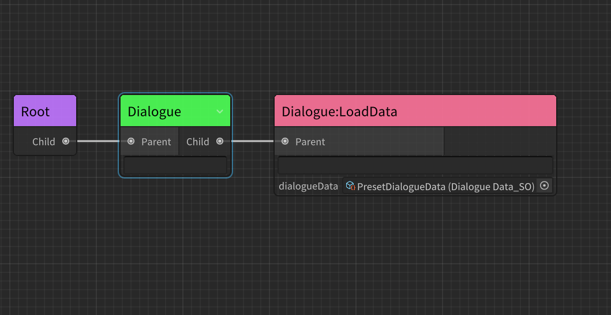
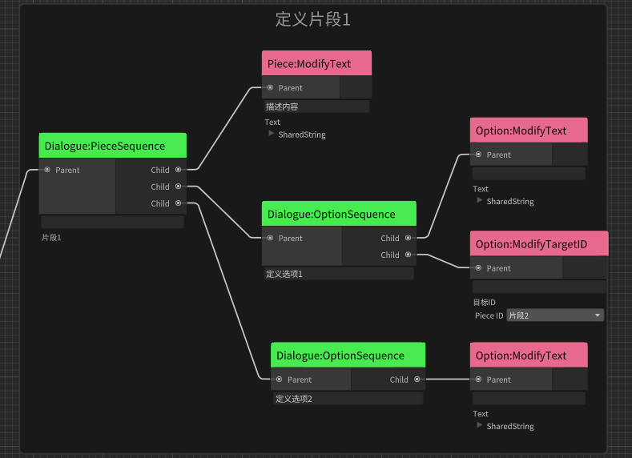
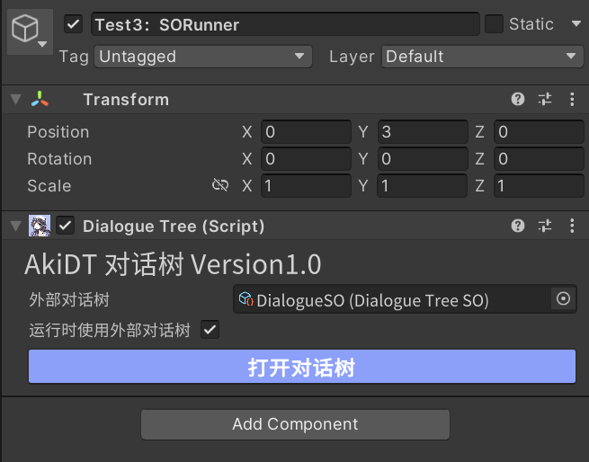
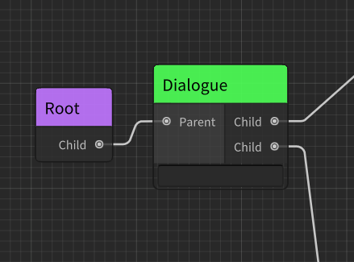
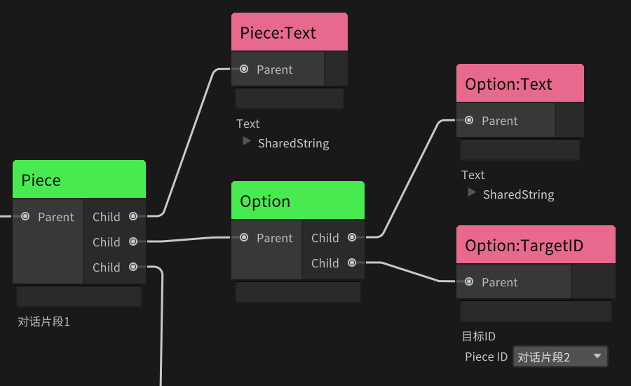

# 对话系统 AkiDialogue 简介 Intro


[爱姬kurisu](https://space.bilibili.com/20472331)开发的一款简易对话系统，支持可视化编辑和静态填写(ScriptableObject),可视化使用AkiDT(由行为树AkiBT修改),因此可以快速衔接到使用AkiBT行为树的AI框架中。

## 插件依赖

[AkiBT行为树](https://github.com/AkiKurisu/AkiBT)用于提供可视化框架和部分实用结点

安装依赖插件,在manifest.json中添加

```
{
  "dependencies": {
      ...
      "com.kurisu.akibt": "https://github.com/AkiKurisu/AkiBT.git?path=/AkiBT"
      ...
  }
}
```
# 安装Setup
1. [Download Release Package](https://github.com/AkiKurisu/AkiDialogue/releases)直接下载最新的UnityPackage
2. Using git URL to download package by Unity PackageManager(https://github.com/AkiKurisu/AkiDialogue.git?path=/AkiDialogue)
#

# AkiDialogue特点Features

* 支持使用ScriptableObject预设对话内容
  
  

* 支持使用可视化编辑器AkiDT构造对话树，实现动态生成对话
* 对话树框架完全继承自行为树框架，不会出现单端口多连线或回路。
* 对于动态对话的生成，AkiDT采取一种“描述式”设计模式
  
  
    
  如图，我们先定义一个对话片段，然后使用Action结点描述其内容，再定义了一个对话选项，同样使用Action结点描述其内容、目标索引。

* 支持使用ScriptableEvents在场景中发送事件，对于需要动态绑定的事件，你可以使用Action结点进行绑定。
* 支持导出DialogueTreeSO并且支持运行时直接使用DialogueTreeSO输出对话。

  

# 注意事项Matters need attention

1. 请勿使用带有Running返回值的Nodes：
* 虽然使用行为树的框架，但对话树并不支持所有行为结点，对于返回Status.Running的Nodes并不会在下一次Update中继续调用，因为和行为树不同的是，对话树不会在Update中持续更新，而是通过调用方法函数生成一段对话。对话树的整个生命周期自方法进入开始，自方法退出后结束。如果结点存在Running可能会导致无法生成对话。

2. 可以使用的Nodes：
* Nodes返回Running会导致对话树无法生成对话，而返回Failure会使子结点无法运行，从而我们可以实现一些分支逻辑。
* 你可以使用行为树中的Conditional结点对一些数值进行判断，例如判断玩家的等级、经验值，根据结果提供不同的对话内容或选项。
* 你可以使用行为树中的Composite结点对其他结点进行组合，例如Selector可以实现依次判断，Parallel支持同时判断。
* 对于行为树中的BuiltIn Action结点，我只推荐使用Math、Vector3、Debug结点，其余例如Animator、Navmesh我更推荐在AkiBT行为树中使用，因为每次调用PlayDialogue只会触发一次Update，你无法在对话树中实现时序行为，因此在对话树中使用最多只能触发一次Action，当然如果你希望对话树判断了A后，对话树自动执行A行为（瞬间行为，例如切换表情，播放特效），这也是可行方案。

# 使用方法How To Use
以下是一段对话的生成流程

1. 创建Dialogue结点开始描述对话内容


2. 创建Piece结点开始描述对话片段，当你Create一个新的Piece结点时，它会自动生成一个PieceID，并且在左侧黑板区域显示，它的运行方式与AkiBT中支持的SharedVariable共享变量一致，但不同的是你无需填写该变量的值只需知道变量的名称，其值会在游戏运行时自动生成。你可以通过双击黑板中的PieceID来修改名称。同时基于PieceID的唯一性，你无法复制Piece结点。


3. 使用ModifyPieceText结点描述对话内容
4. 创建Option结点开始描述对话选项
5. 使用ModifyOptionTargetID结点描述选项目标ID，如上图所示，每个Piece都有自己的PieceID，对话选项选择后可以指向一个新的片段，因此我们只需要在下拉菜单中找所需片段即可。

6. 使用ModifyOptionText结点描述选项内容


# 样例说明Example Info
1. 由于AkiDT对话树只负责对话数据的生成，要体验对话必须有UI，我在Example中提供了一套简单的UserInterface，因此你可以在DialogueExample场景中直接体验AkiDialogue提供的三种对话生成方式。
2. 如果你要使用自己的UserInterface需要注意DialogueManager提供的几个方法和事件，例如DialogueOver方法可以让DialogueManager广播OnDialogueOver事件，但这个方法需要在UserInterface中进行调用，原因在通常我们不会希望对话立刻显示或者一显示完就结束对话，我们需要逐字打印或者等待一段时间，这部分请由设计者自己决定。

