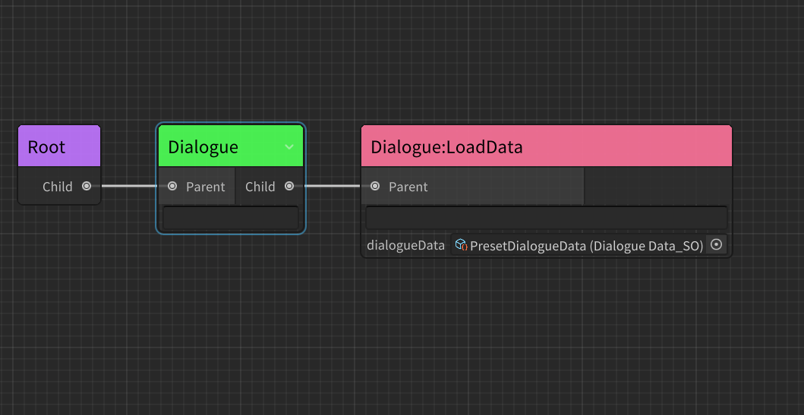
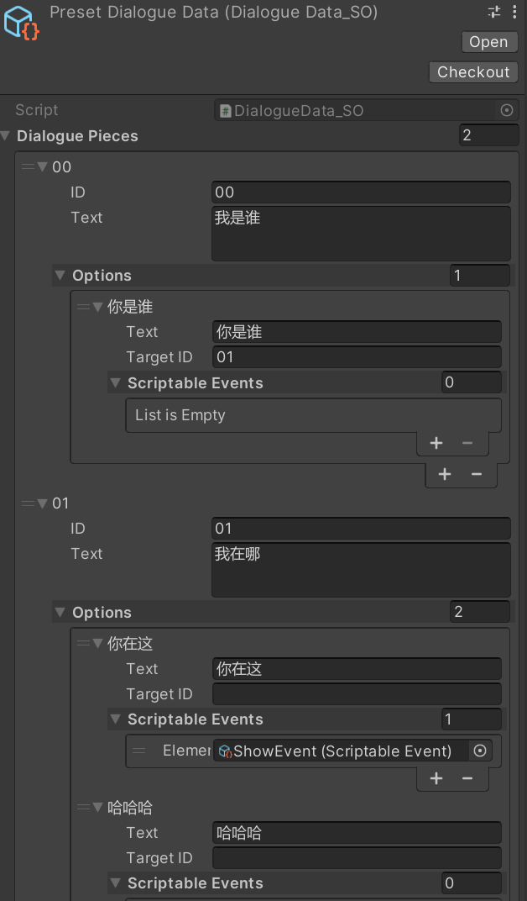
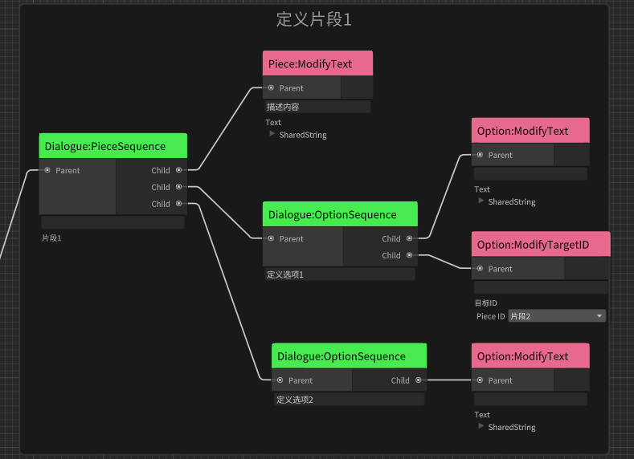
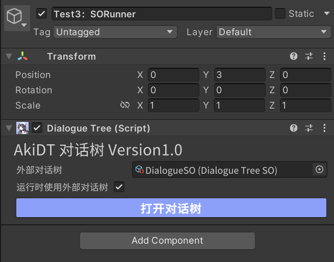
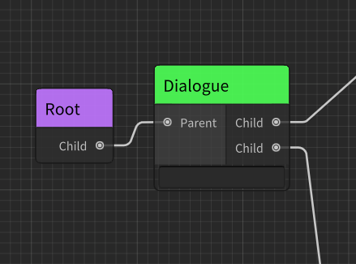
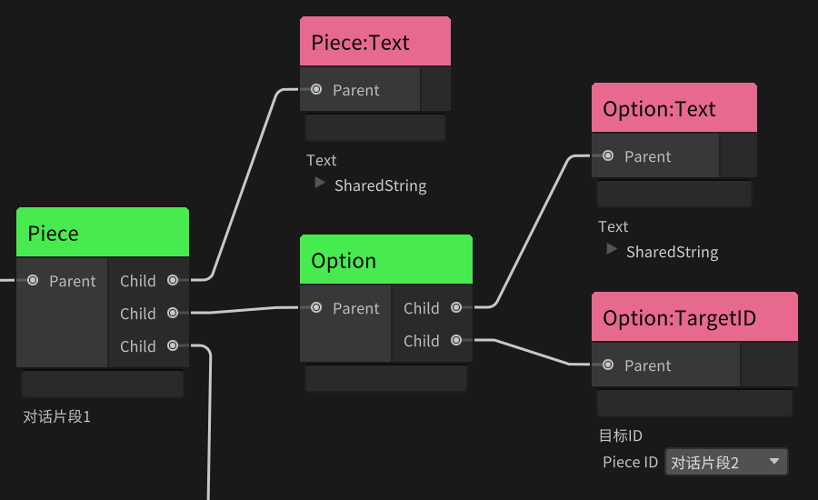
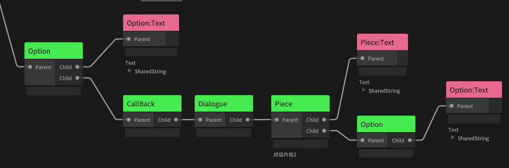
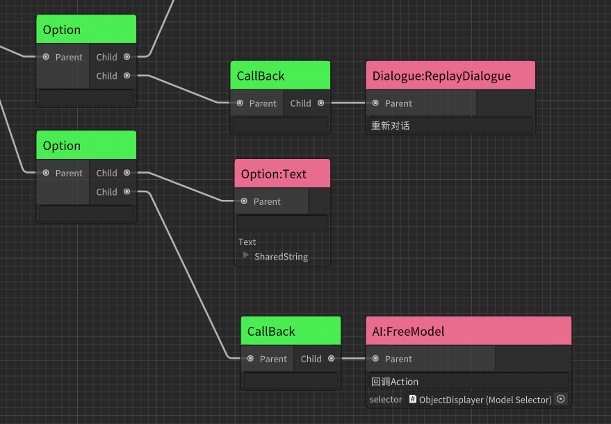

# 对话系统 AkiDialogue 简介 Intro


[爱姬kurisu](https://space.bilibili.com/20472331)开发的一款简易对话系统，支持可视化编辑和静态填写(ScriptableObject),可视化使用AkiDT(由行为树AkiBT修改),因此可以快速衔接到使用AkiBT行为树的AI框架中。

## 插件依赖

[AkiBT行为树](https://github.com/AkiKurisu/AkiBT)用于提供可视化框架和部分实用结点

安装依赖插件,在manifest.json中添加

```
{
  "dependencies": {
      ...
      "com.kurisu.akibt": "https://github.com/AkiKurisu/AkiBT.git?path=/AkiBT"
      ...
  }
}
```
# 安装Setup
1. [Download Release Package](https://github.com/AkiKurisu/AkiDialogue/releases)直接下载最新的UnityPackage
2. Using git URL to download package by Unity PackageManager(https://github.com/AkiKurisu/AkiDialogue.git?path=/AkiDialogue)
#

# AkiDialogue特点Features

* 支持使用ScriptableObject预设对话内容
  
  

  

* 支持使用可视化编辑器AkiDT构造对话树，实现动态生成对话
* 对话树框架完全继承自行为树框架，不会出现单端口多连线或回路。
* 对于动态对话的生成，AkiDT采取一种“描述式”设计模式
  
  
    
  如图，我们先定义一个对话片段，然后使用Action结点描述其内容，再定义了一个对话选项，同样使用Action结点描述其内容、目标索引。

* 支持使用ScriptableEvents在场景中发送事件，对于需要动态绑定的事件，你可以使用Action结点进行绑定。
* 支持导出DialogueTreeSO并且支持运行时直接使用DialogueTreeSO输出对话。

  

# 注意事项Matters need attention

1. 请勿使用带有Running返回值的Nodes：
* 虽然使用行为树的框架，但对话树并不支持所有行为结点，对于返回Status.Running的Nodes并不会在下一次Update中继续调用，因为和行为树不同的是，对话树不会在Update中持续更新，而是通过调用方法函数生成一段对话。对话树的整个生命周期自方法进入开始，自方法退出后结束。如果结点存在Running可能会导致无法生成对话。

2. 可以使用的Nodes：
* Nodes返回Running会导致对话树无法生成对话，而返回Failure会使子结点无法运行，从而我们可以实现一些分支逻辑。
* 你可以使用行为树中的Conditional结点对一些数值进行判断，例如判断玩家的等级、经验值，根据结果提供不同的对话内容或选项。
* 你可以使用行为树中的Composite结点对其他结点进行组合，例如Selector可以实现依次判断，Parallel支持同时判断。
* 对于行为树中的BuiltIn Action结点，需要注意的是每次调用PlayDialogue只会触发一次Update，因此通常情况下在对话树中同一Action结点在一次PlayDialogue中只能触发一次。如果你希望玩家选择某一选项后再执行Action，请参考下面的CallBack功能
  

# 使用方法How To Use
以下是一段正常对话的生成流程

1. 创建Dialogue结点开始描述对话内容



2. 创建Piece结点开始描述对话片段，当你Create一个新的Piece结点时，它会自动生成一个PieceID，并且在左侧黑板区域显示，它的运行方式与AkiBT中支持的SharedVariable共享变量一致，但不同的是你无需填写该变量的值只需知道变量的名称，其值会在游戏运行时自动生成。你可以通过双击黑板中的PieceID来修改名称。同时基于PieceID的唯一性，你无法复制Piece结点。



3. 使用ModifyPieceText结点描述对话内容
4. 创建Option结点开始描述对话选项
5. 使用ModifyOptionTargetID结点描述选项目标ID，如上图所示，每个Piece都有自己的PieceID，对话选项选择后可以指向一个新的片段，因此我们只需要在下拉菜单中找所需片段即可。

6. 使用ModifyOptionText结点描述选项内容
   
# 高级用法:CallBack

  1. 和行为树不同，对话树不会主动进行Update，但这并不代表我们无法使用一些延时的操作。这个需求常见于选项触发后修改了一个变量，而后续的对话内容依赖于该变量。因此我们无法通过ModifyTargetID直接进行跳转，因为一旦使用PlayDialogue，对话内容就已经构造完成，我们无法在对话中修改已构造的内容。更好的做法是在玩家点击选项后再生成下一段对话，我们可以使用内置的PlayDialogueTree来播放其他对话树。也可也使用CallBack来构造一个回调。
  
  2. 如下图所示：我们为Option定义了内容，但不定义任何TargetID，而是定义了一个回调CallBack。因此对话系统会在该选项选中后触发CallBack，再运行该结点之后的结点。图中即重新构造一段新的对话。需要注意的是，新构造的对话(图中为CallBack之后的Dialogue)和之前的对话没有联系，因此你不应在之后的选项索引到之前的对话片段ID(PieceID)。
   
  

  3. 我们通常会有一个需求即玩家选择选项后触发一系列动作，例如获得奖励、接受任务，再AkiDialogue中，我们可以使用ScriptableEvent通过事件来传递信息，当然我们也可以采取类似于行为树的设计模式通过Action结点直接运行行为。如下图，我们仍使用CallBack方式，让两个Action结点在选项点击后再执行。

  


# 使用代码生成对话：Create Dialogue By Code

  对于一些常见需求，AkiDialogue都提供了构造对话树的方法，但你的游戏中也可能需要一些特殊的对话生成方式，这些对话可能会与其他系统耦合。所以使用代码反而完成会更简单（使用结点方式则需要创建多个结点或者引用多个组件）。
  下面我将演示一个简单的脚本方式创建动态对话。

  ```c#
  public class DynamicTest
  {
    //要使用动态的对话生成我们需要创建一个Generator
    private DialogueGenerator generator=new DialogueGenerator();

    public void CreateDialogue()
    {
        //我们可以复用Generator，但每次生成对话之前需要清空之前的内容
        generator.Clear();
        //我们使用对象池来复用实例化的对话片段和选项
        var piece1=DialogueGenerator.CreatePiece();
        //定义片段内容和ID
        piece1.text="片段1的内容";
        piece1.ID="01";
        var option=DialogueGenerator.CreateOption();
        //定义选项内容和目标ID
        option.text="选项内容";
        option.targetID="02";
        option.OnSelectAction+=()=>{};//添加你的回调函数
        piece1.options.Add(option);
        //填充完后我们将对话片段添加近Generator中
        generator.AddPiece(piece1);
        var piece2=DialogueGenerator.CreatePiece();
        piece2.text="片段2的内容";
        piece2.ID="02";
        generator.AddPiece(piece2);
        //最后我们将整个Generator上传给DialogueSystem进行播放
        DialogueManager.Instance.UpdateDialogueData(generator);
    }
  }

  ```
  如果你只是需要播放一个固定的对话，这在一些老游戏中很常见，实现这个功能也非常简单。
  ```c#
  public class StaticTest
  {
    //我们使用预先设置好的对话内容
    [SerializeField]
    private DialogueData_SO data;

    public void CreateDialogue()
    {
        //对，就是这么简单
        DialogueManager.Instance.UpdateDialogueData(data);
    }
  }

  ```

# 对话系统 DialogueSystem
  AkiDialogue使用的对话系统较为简单，唯一需要注意的是如果一段对话在播放时，你又触发了一个新的对话，后者会存进对话队列中，在前一个对话片段结束时再播放。

# 样例说明Example Info
1. 由于AkiDT对话树只负责对话数据的生成，要体验对话必须有UI，我在Example中提供了一套简单的UserInterface，因此你可以在DialogueExample场景中直接体验AkiDialogue提供的三种对话生成方式。
2. 如果你要使用自己的UserInterface需要注意DialogueManager提供的几个方法和事件，例如DialogueOver方法可以让DialogueManager广播OnDialogueOver事件，但这个方法需要在UserInterface中进行调用，原因在通常我们不会希望对话立刻显示或者一显示完就结束对话，我们需要逐字打印或者等待一段时间，这部分请由设计者自己决定。

